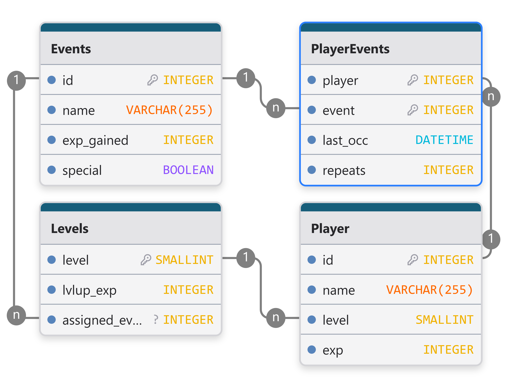
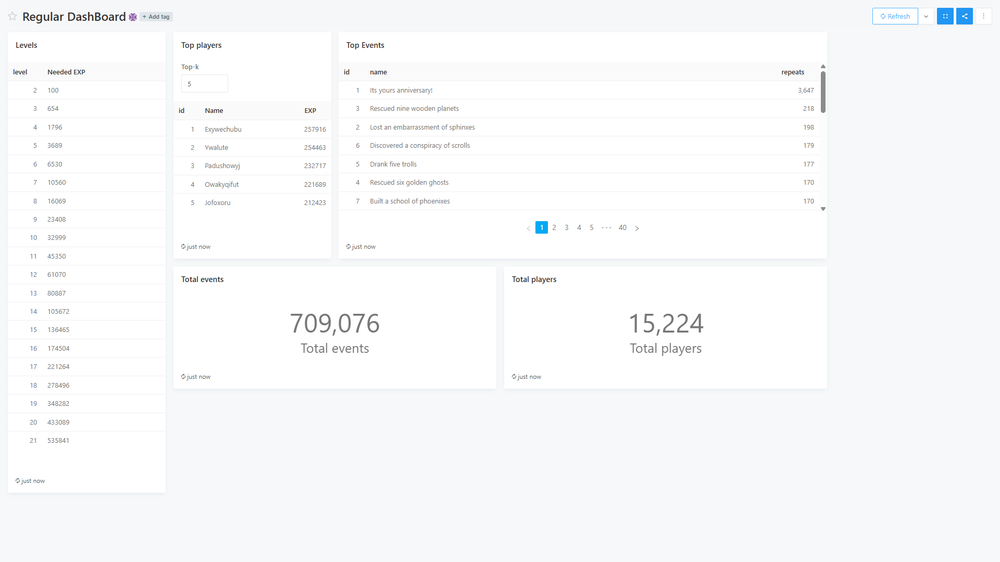

# Лабораторная работа по дисциплине Аналитик данных

## Установка и запуск

### Установка

```cmd
git clone https://github.com/endermend/data-analisys.git
```

### При первым запусков

```cmd
docker compose run --rm redash-server create_db
```

### Запуск

```cmd
docker compose up
```

## Задание

[Задание](./docs/spec.md)

### Генератор данных

### База данных

MySQL



### Redash

[Запросы](./docs/redash_queries.sql)



### Немного об инструкции

При написании README нагло воровал у:

- [Машьянов Владимир](https://github.com/VL1507/data_analysis_fefu/blob/main/README.md)